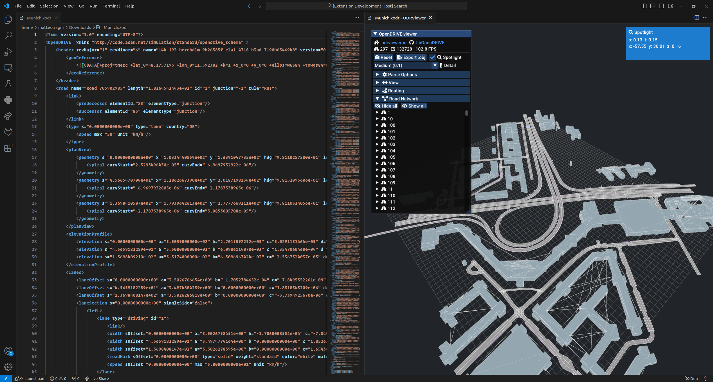
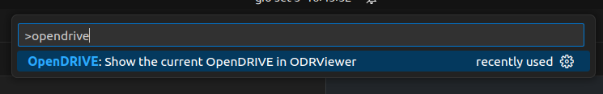
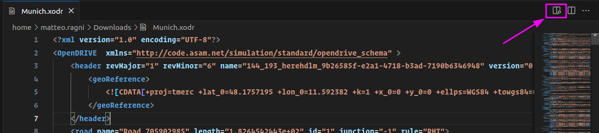

# ODRViewer.io in VSCode

The extension allow to visualize OpenDRIVE file in Visual Studio Code. Unshamelessy stolen from the awesome
[odrviewer.io](https://odrviewer.io) and modified just enough to be used in the editor

To launch the visualization, simply click on the preview button while in an editor for a file ending with `".xodr"`
or launch the command `OpenDRIVE: Show the current OpenDRIVE in ODRViewer`

## Original Author

Original author and copyright holder is [Sebastian Pagels](https://github.com/pageldev). The application is built
on the top of the awesome [libOpenDRIVE](https://github.com/pageldev/libOpenDRIVE).

> Please consider a donation to ODRViewer and libOpendDRIVE original projects (donation link is on 
[odrviewer.io](https://odrviewer.io) bottom right corner).

## Extension Settings

There are currently no extensions settings.

## Known Issues

 * `Export .obj` functionality is not available currently, with the plan of implementing it in the future.

## Release Notes

Users appreciate release notes as you update your extension.

### 1.0.0

Initial release

**Enjoy!**
